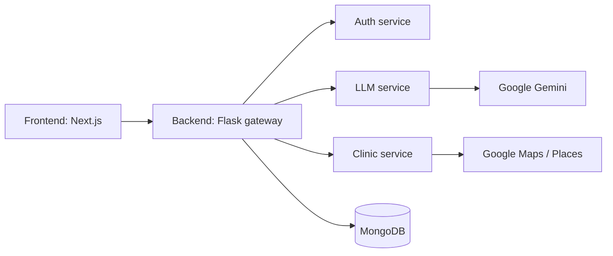
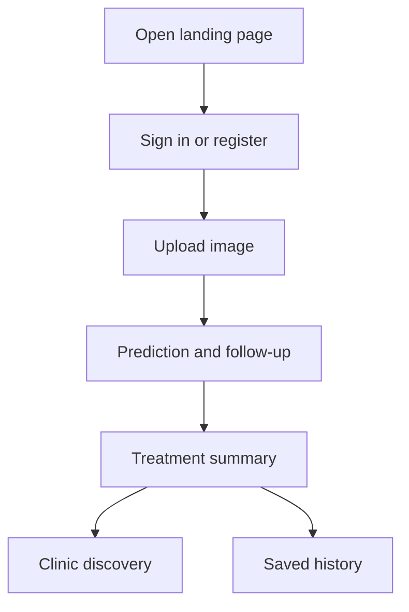

# Adermis Project Overview

This folder contains the implementation for the Adermis application. The README files alongside the code explain the backend, frontend, and service boundaries in detail.

---

## Documentation Index

* [Backend platform](backend/README.md)
* [Frontend app](adermis/README.md)
* [Auth service](backend/services/auth/README.md)
* [LLM service](backend/services/llm/README.md)
* [Clinic service](backend/services/clinic/README.md)

---

## What This Project Is

Adermis is a guided skin-disease screening product. The backend handles authentication, analysis orchestration, language-model enrichment, clinic lookup, and scan persistence. The frontend presents those capabilities as one linear user experience.

---

## High-Level Architecture

---

## Product Journey

---

## Where To Read Next

1. [Backend platform](backend/README.md)
2. [Frontend app](adermis/README.md)
3. [Auth service](backend/services/auth/README.md)
4. [LLM service](backend/services/llm/README.md)
5. [Clinic service](backend/services/clinic/README.md)

---

## Setup Note

Use the backend and frontend READMEs for the exact startup commands and environment variables.

---

## Disclaimer

Adermis is intended for educational and preliminary screening purposes only. It does not replace professional medical diagnosis or treatment.