# Frontend App

# Frontend

This folder contains the Next.js application that users actually interact with. It is the presentation layer for the product: landing pages, authentication screens, the scan workflow, the dashboard, and supporting legal pages.

The app is designed to feel like a guided health experience, not a generic admin dashboard.

---

## App Overview

### Purpose

Render the user journey, collect scan inputs, display predictions and treatment guidance, and keep the authenticated experience coherent.

### Problem Solved

The backend produces structured data, but users need a readable interface to upload images, answer follow-up questions, and move between analysis and nearby clinic recommendations.

### Business Value

This layer turns the backend into a product. It manages perception, flow, and trust.

### Main Responsibilities

* present the landing and marketing pages
* handle sign-in, sign-up, and session awareness
* guide the scan workflow across upload, analysis, and clinic steps
* show dashboard history and profile data
* render policy pages like privacy and terms

---

## Architecture Overview

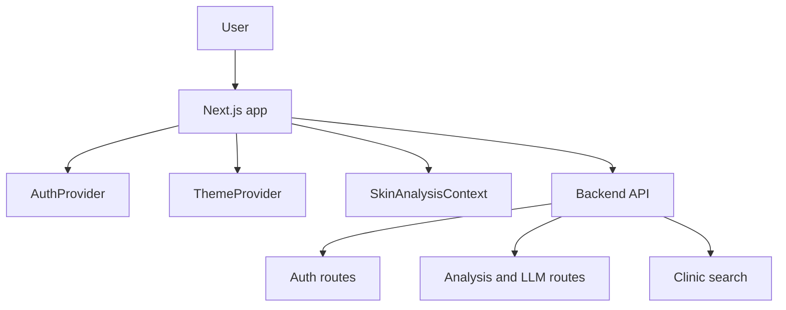

The frontend is a client-heavy App Router application with shared providers that keep cross-page state stable during the scan journey.

---

## Route Map

### Public pages

* `/` landing page
* `/login`
* `/register`
* `/privacy`
* `/terms`
* `/contact`

### Authenticated pages

* `/dashboard`
* `/dashboard/history`
* `/dashboard/profile`

### Scan workflow

* `/scan/upload`
* `/scan/analysis`
* `/scan/clinics`

### Why the routes are split this way

The product has two different modes: discovery and care flow. Public pages sell the experience and explain the product, while authenticated pages hold scan history and profile state.

---

## Component Breakdown

### `src/app/layout.tsx`

#### Responsibility

Define the global app shell and HTML structure.

#### Why It Exists

It centralizes app-wide metadata, fonts, and layout wrappers.

### `src/app/RootLayoutClient.tsx`

#### Responsibility

Apply client-side providers and cross-cutting UI state.

#### Why It Exists

This keeps provider wiring out of the pure server layout and makes the browser-only parts explicit.

### `src/components/providers/AuthProvider.tsx`

#### Responsibility

Keep the signed-in user synchronized with the backend.

#### Inputs

* auth session data from the backend

#### Outputs

* current user state
* loading and auth lifecycle state

#### Why It Exists

The dashboard and scan pages need to know whether the user is authenticated without repeating session fetch logic everywhere.

### `src/components/providers/ThemeProvider.tsx`

#### Responsibility

Manage the application theme state.

#### Why It Exists

It keeps visual preferences decoupled from the scan and auth workflows.

### `src/app/scan/context/SkinAnalysisContext.tsx`

#### Responsibility

Persist scan state across upload, analysis, and clinic pages.

#### Stored State

* uploaded image preview
* prediction results
* analysis metadata
* follow-up answers
* clinic search context

#### Why It Exists

The scan experience spans multiple routes, so state must survive navigation without being re-fetched or rebuilt on each page.

---

## Scan Flow

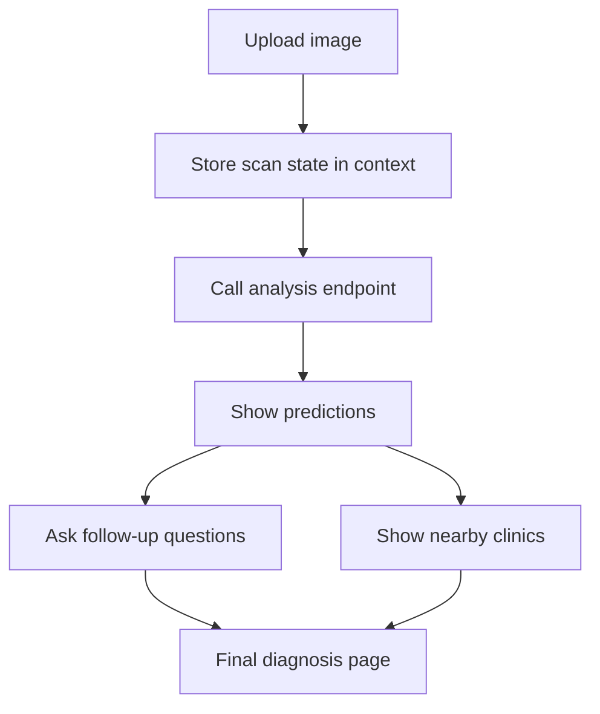

### Lifecycle Notes

#### Before processing

The upload page captures the image and validates the basic inputs.

#### During processing

The analysis page keeps the user informed while backend calls are in flight.

#### After processing

The user gets a structured diagnosis summary and optional care-next-step recommendations.

#### Error scenarios

* no image selected -> block progression
* API unavailable -> show an error and preserve local state
* session expired -> redirect to login

---

## Internal Workflows

### Upload page

The upload page is the entry point to the scan flow. It accepts an image, sets it in shared context, and starts the analysis process.

### Analysis page

The analysis page reads the prediction data, renders the ranked conditions, and collects any follow-up answers needed for the final diagnosis.

### Clinics page

The clinics page uses the diagnosis or location context to request nearby care options and present them in a user-friendly list.

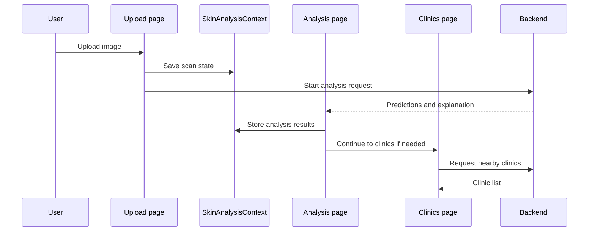

---

## Data Flow

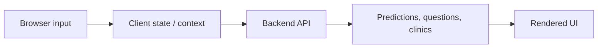

The frontend keeps transient scan state locally, but the backend remains the source of truth for predictions and history.

---

## Design Decisions

### Why this architecture was chosen

The scan experience benefits from route-based steps because each stage has a distinct user intent: upload, review, refine, and find care.

### Why components are separated

Layout, providers, page content, and scan state have different lifecycles. Separating them avoids coupling the entire app to one giant client component.

### Why these libraries were used

* Next.js App Router gives a clear route structure
* React 19 supports modern component patterns
* TypeScript improves safety across the multi-step scan flow
* Tailwind CSS keeps the UI composition fast and consistent
* Framer Motion supports polished interaction and motion design

---

## Performance Considerations

* scan state is kept in memory while the user moves between pages
* the backend URL is read from one environment variable
* client-side providers reduce repeated fetching for auth state
* the app avoids reloading the full flow when only one step changes

The major performance costs are image upload, backend inference, and external API calls, not the page shell itself.

---

## Scalability Considerations

The frontend scales naturally as a static or hybrid-rendered Next.js app.

Potential bottlenecks include:

* large image uploads
* repeated auth state checks
* client-side state becoming harder to manage if the scan flow grows

Future improvements could include stronger state partitioning and streaming UI updates for longer analysis operations.

---

## Reliability and Error Handling

The app is designed to preserve user input when backend calls fail.

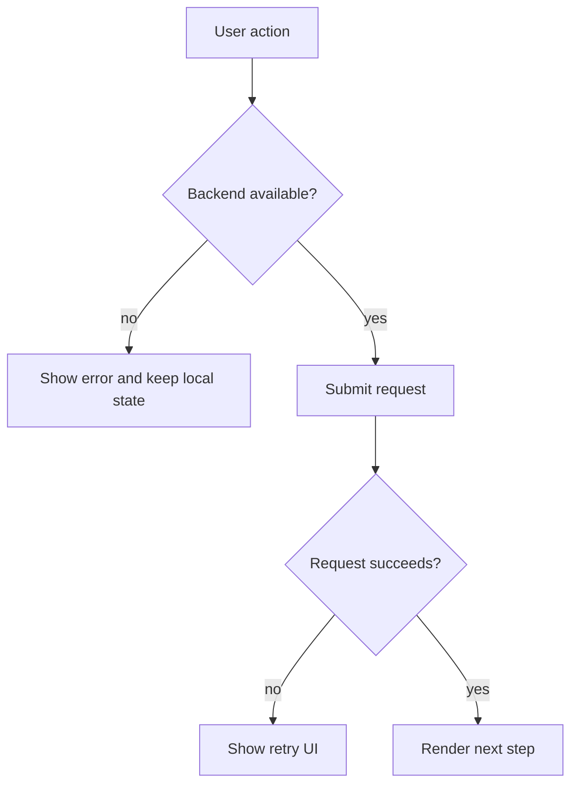

Common recovery paths:

* retry the request
* re-authenticate if the session expires
* return to the upload step without losing the selected file preview

---

## External Dependencies

* the Flask backend API
* browser geolocation and upload capabilities
* auth cookies from the backend session flow

---

## Project Structure

```text
adermis/src/
├── app/
│   Purpose: route-level pages and layouts
├── components/
│   Purpose: reusable UI, layout, and provider code
├── lib/
│   Purpose: helper utilities and auth glue
└── public/
  Purpose: static assets
```

---

## Request Journey

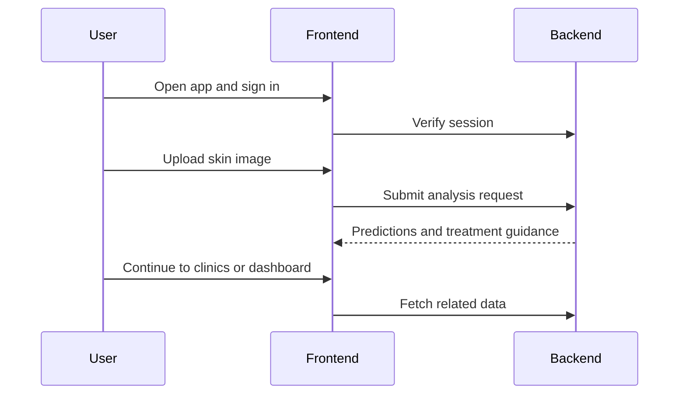
* the frontend coordinates with the backend but does not own business logic
* the upload-analysis-clinic chain is the core experience

---

## Component Breakdown

### `src/app/layout.tsx`

#### Responsibility

Set the document shell, metadata, theme bootstrap, and global body styling.

#### Inputs

* route content
* theme preference stored in local storage

#### Outputs

* rendered HTML shell for every page

#### Why It Exists

It keeps the app’s global identity and dark-mode bootstrapping consistent across routes.

---

### `src/app/RootLayoutClient.tsx`

#### Responsibility

Wrap the application in shared client-side providers.

#### Why It Exists

The app needs a stable place to attach providers that depend on browser state.

---

### `src/components/providers/AuthProvider.tsx`

#### Responsibility

Track the signed-in user, refresh session state, and expose login/logout helpers.

#### Inputs

* backend auth API responses

#### Outputs

* current user state
* auth actions for the UI

#### Why It Exists

It keeps authentication behavior centralized instead of duplicating session checks across pages.

---

### `src/app/scan/context/SkinAnalysisContext.tsx`

#### Responsibility

Hold the current scan input and result while the user moves between upload, analysis, and clinic pages.

#### Inputs

* selected image
* analysis response from the backend

#### Outputs

* cross-page scan state

#### Why It Exists

The scan flow is multi-step, so the result must persist across several routes without re-uploading or recomputing.

---

### Visual components in `src/components/ui/`

#### Responsibility

Provide the app’s animated visual language.

#### Why They Exist

The project intentionally uses motion and layered surfaces to make the health journey feel guided and more premium than a plain form flow.

---

### Scan pages

* `/scan/upload` accepts an image and submits analysis work
* `/scan/analysis` renders predictions, severity, descriptions, and recommendations
* `/scan/clinics` shows nearby clinics based on geolocation

#### Why They Exist

These pages define the core product loop.

---

## End-to-End Flow

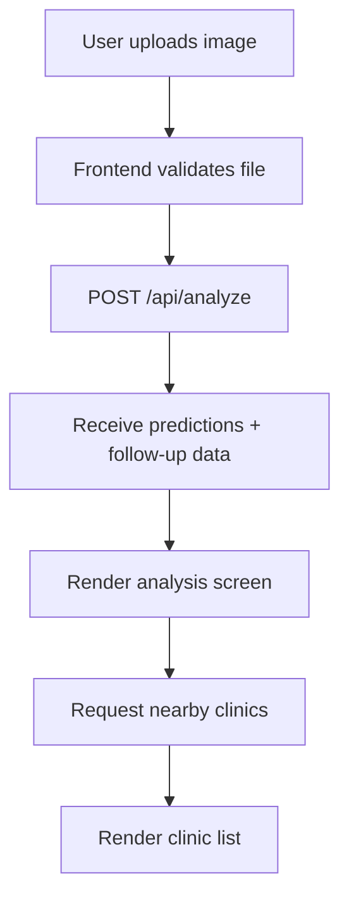

### Step-by-step

1. The user opens the landing page and enters the scan flow.
2. The upload screen validates the image and prepares the form submission.
3. The frontend posts the image to the backend.
4. The result is normalized into the client-side scan context.
5. The analysis page renders the top condition, confidence, description, and recommendations.
6. The clinics page uses browser geolocation and the backend lookup endpoint.

---

## Internal Workflows

### Authentication flow

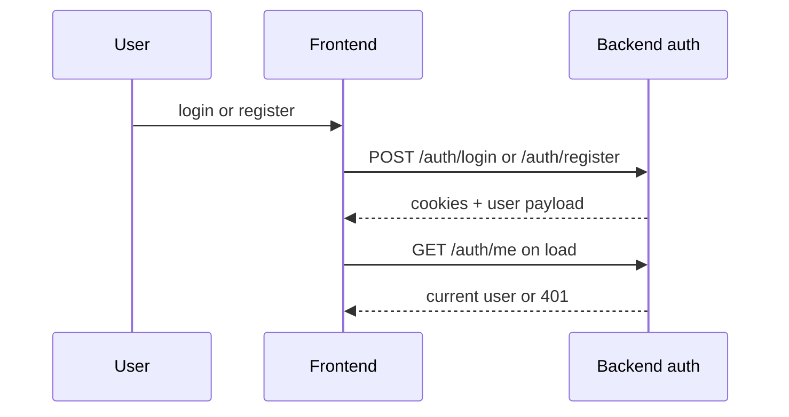

### Scan flow

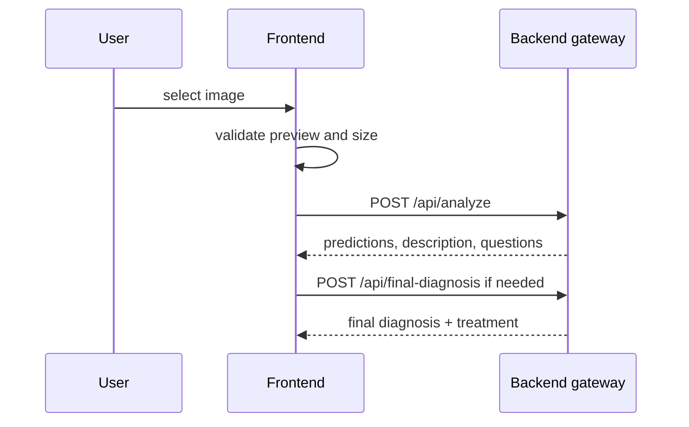

### Clinic lookup flow

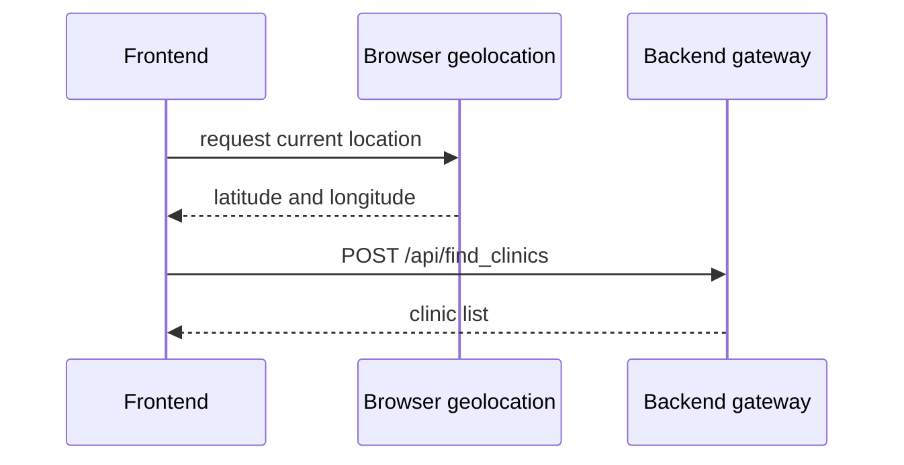

Only these workflows exist in the frontend: auth, scan, analysis, dashboard, and clinic discovery.

---

## Data Flow

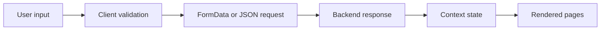

The frontend mostly transforms user intent into API requests and normalizes responses into route-scoped state.

---

## Lifecycle Analysis

### Before processing

* the shell layout loads theme and metadata
* auth state is fetched
* scan state is initialized empty

### During processing

* user actions update local component state
* uploads are validated before submission
* backend responses are normalized for the UI

### After processing

* scan context persists across pages
* auth context remains available to dashboard and profile routes
* clinic results can be opened in Google Maps

### Error scenarios

* invalid image type or size -> client-side toast error
* backend unavailable -> network error guidance
* missing location permission -> clinic page fallback state

---

## Design Decisions

### Why this architecture was chosen

The App Router plus provider-based state works well for a guided, multi-step flow with persistent session and scan context.

### Why components are separated

* auth state should not be mixed into scan state
* scan state should survive route transitions without server round-trips
* visual components should be reusable across landing and product pages

### Why the chosen libraries were used

* Next.js provides routing and server/client composition
* React keeps the interaction model simple
* Tailwind CSS supports the strong visual language quickly
* Framer Motion supports the intentional motion system used throughout the app

---

## Performance Considerations

* route-level code splitting comes naturally through the App Router
* upload validation prevents unnecessary network calls
* scan state avoids duplicate analysis submissions when moving between pages
* image previews are handled locally before upload

There is no batch processing here. The optimization focus is on perceived responsiveness and minimizing unnecessary backend calls.

---

## Scalability Considerations

### Current scaling model

The frontend scales as a static-capable React application served with Next.js runtime behavior where needed.

### Potential bottlenecks

* large image uploads
* repeated auth refresh calls
* backend latency for scan analysis

### Horizontal scaling opportunities

* move static assets to a CDN
* cache public landing content aggressively
* split heavy scan rendering into smaller route-level chunks if the app grows

---

## Reliability and Error Handling

### Validation strategy

The upload page validates file type and size before sending anything to the backend.

### Failure handling

The app uses user-friendly toasts and fallback UI states rather than raw stack traces.

### Recovery paths

* failed analysis -> user can resubmit the image
* blocked geolocation -> user can retry location access
* expired session -> auth provider refreshes or falls back to logged-out state

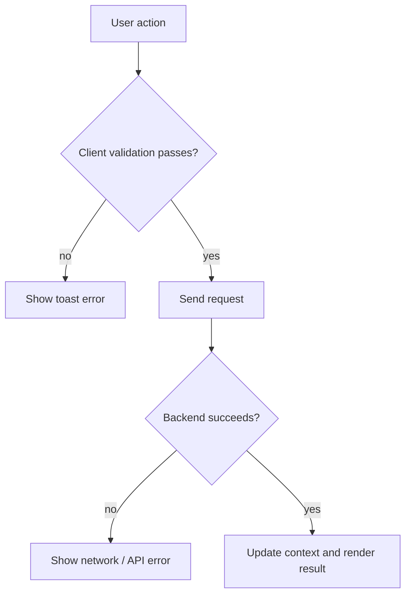

---

## External Dependencies

* backend API at `NEXT_PUBLIC_BACKEND_URL`
* browser geolocation API
* cookies for auth session handling
* Framer Motion and React Hot Toast for interaction feedback

---

## Project Structure

```text
adermis/
├── src/app/
│   Purpose: route pages, layouts, and scan flow screens
│   Relationship: provides the user-facing experience
├── src/components/
│   Purpose: reusable layout, provider, and UI building blocks
│   Relationship: used across landing, auth, dashboard, and scan pages
├── src/lib/
│   Purpose: frontend helpers for auth and utilities
│   Relationship: supports providers and page logic
├── public/
│   Purpose: static assets
│   Relationship: consumed by the app shell and pages
├── package.json
│   Purpose: dependency and script manifest
│   Relationship: defines the Next.js toolchain
└── README.md
  Purpose: frontend design document
```

---

## Request Journey

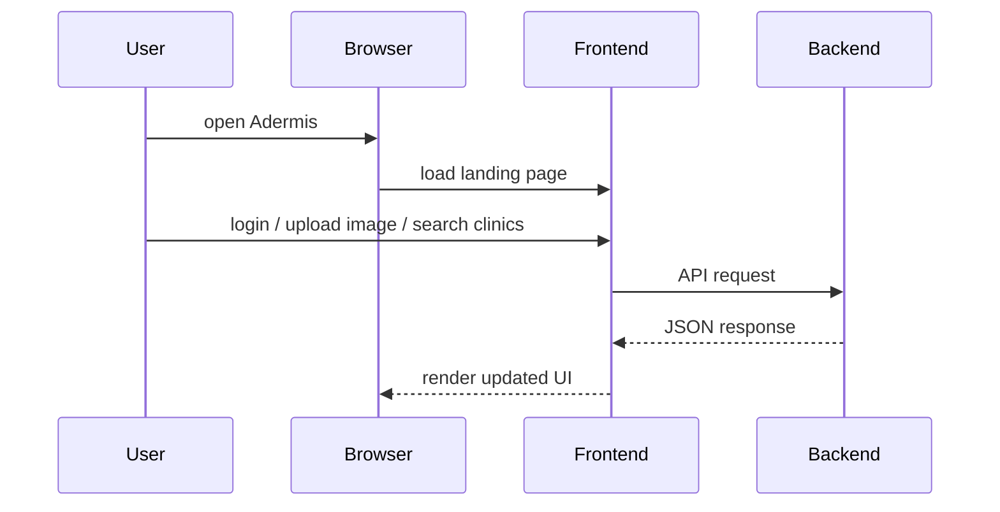

