# Backend Platform

## Service Overview

This directory contains the Flask backend that powers Adermis. It acts as the product’s orchestration layer, connecting the frontend to authentication, ML inference, LLM generation, clinic discovery, and MongoDB persistence.

### Purpose

Provide a unified API surface for the application.

### Problem Solved

The frontend should not need to know which internal service performs which part of the diagnosis flow. The backend hides that complexity behind a single gateway process.

### Business Value

The backend turns multiple specialized subsystems into one coherent product experience: log in, upload an image, get analysis, ask follow-up questions, store the scan, and find nearby care.

### Main Responsibilities

* register all service blueprints
* expose shared scan and stats endpoints
* persist scan history and user data
* provide a single deployment target for the frontend

---

## Architecture Overview

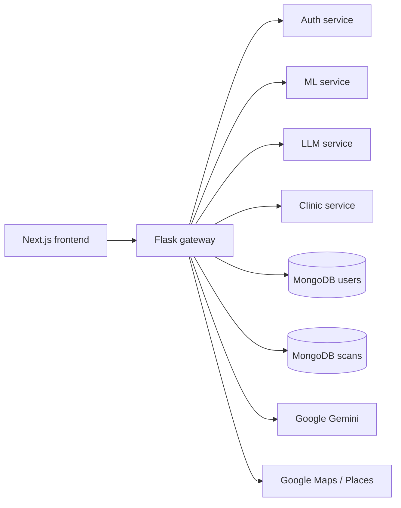

### What the diagram means

* the gateway is the public backend entrypoint
* the service blueprints split responsibilities without splitting deployments
* MongoDB stores users and scan history
* Gemini and Google Maps are external dependency boundaries

---

## Component Breakdown

### `gateway.py`

#### Responsibility

Host the Flask app, register blueprints, orchestrate multi-step analysis flows, and serve scan history and dashboard stats.

#### Inputs

* form data and JSON requests from the frontend
* cookies or bearer tokens for authenticated endpoints
* MongoDB records for scans and users

#### Outputs

* analysis responses
* diagnosis summaries
* clinic search results
* scan history and dashboard stats

# Backend

This folder contains the Flask platform that powers the Adermis API. It is the orchestration layer between the frontend and the specialized services for auth, LLM generation, clinic search, and ML inference.

The backend is intentionally modular. It runs as one Flask application, but the code is organized like a set of small services so each responsibility stays clear.

---

## Platform Overview

### Purpose

Host the public API, orchestrate service calls, persist scan metadata, and expose shared configuration and lifecycle helpers.

### Problem Solved

The frontend should not need to know which internal module talks to MongoDB, which one calls Gemini, or which one reaches Google Maps. The backend hides those integration details behind a single API surface.

### Business Value

This layer keeps the application maintainable while still allowing the product to combine ML, LLM, identity, and geolocation features in one flow.

### Main Responsibilities

* expose the `/api/*` gateway endpoints
* register service blueprints
* coordinate prediction, explanation, and clinic lookup flows
* store scan records and stats in MongoDB
* manage shared configuration and caches
* provide production and development entry points

---

## Architecture Overview

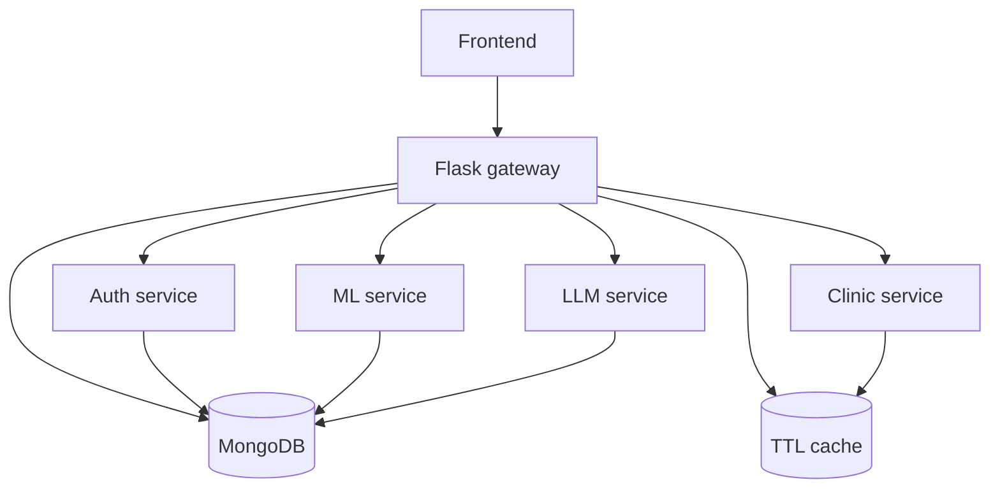

The gateway acts as the central coordinator, while each service module owns one piece of the product behavior.

---

## Component Breakdown

### `gateway.py`

#### Responsibility

Serve as the main API entry point and orchestrate the user-facing scan flow.

#### Endpoints

* `POST /api/analyze`
* `POST /api/final-diagnosis`
* `POST /api/scans`
* `GET /api/stats`
* `POST /api/find_clinics`
* `GET /health`
* `GET /`

#### Internal Workflow

1. Validate the incoming request.
2. Route work to the relevant service module.
3. Merge ML, LLM, and clinic outputs where needed.
4. Persist scan data when required.
5. Return a frontend-ready response.

#### Why It Exists

It is the control plane of the application. The frontend talks to one API, not four separate internal modules.

### `app.py`

#### Responsibility

Construct the Flask app for local development and register blueprints and middleware.

#### Why It Exists

This file is the cleanest place to initialize Flask for development workflows and debugging.

### `wsgi.py`

#### Responsibility

Expose the app object for production WSGI hosting.

#### Why It Exists

Production servers such as Gunicorn or platform hosts need a stable import path for the Flask application.

### `home.py`

#### Responsibility

Provide a minimal landing page or root response.

#### Why It Exists

It gives the deployment a simple human-readable root without coupling to the frontend.

### `config.py`

#### Responsibility

Centralize environment-driven settings.

#### Key Values

* `SECRET_KEY`
* `JWT_SECRET`
* `MONGODB_URI`
* `GOOGLE_API_KEY`
* `GOOGLE_MAPS_API_KEY`
* `MODEL_URL`
* `MODEL_PATH`
* `CLASS_NAMES`
* `CLINIC_CACHE_TTL_SECONDS`

#### Why It Exists

This keeps secrets, endpoints, model paths, and service constants in one place instead of duplicating them across modules.

### `utils/cache.py`

#### Responsibility

Provide a small TTL cache implementation and shared cache instances.

#### Shared Objects

* `clinic_cache`
* `token_blacklist`

#### Why It Exists

It gives the backend lightweight state for token revocation and repeated clinic lookups without pulling in another infrastructure dependency.

---

## End-to-End Flow

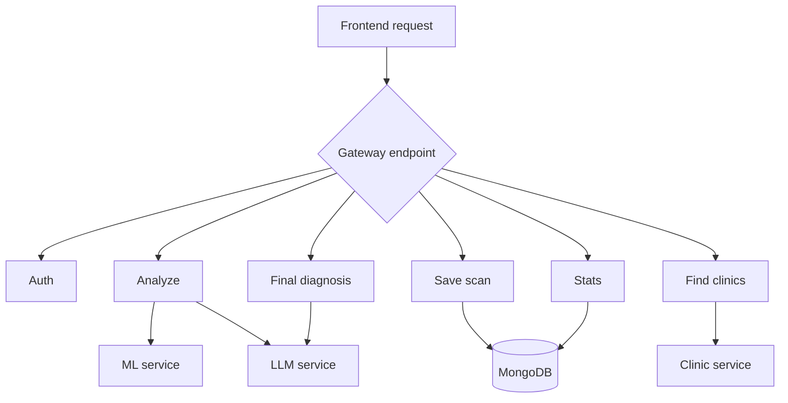

### Lifecycle Notes

#### Before processing

The gateway validates request shape and determines which internal service should handle the work.

#### During processing

The request may fan out to multiple internal modules, especially in the scan and final-diagnosis flows.

#### After processing

Results are merged, normalized, persisted when needed, and returned to the frontend.

#### Error scenarios

* missing request body -> `400`
* failed external API calls -> `500` or partial response depending on the endpoint
* invalid authentication -> `401`

---

## Internal Workflows

### Scan orchestration

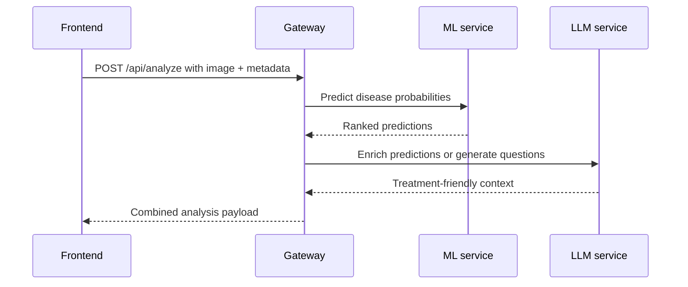

### Clinic lookup workflow

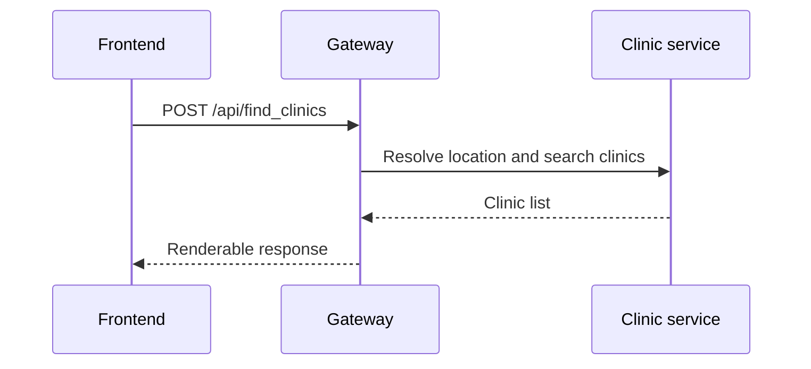

This backend has no task queue or event bus. The orchestration is synchronous and request-driven.

---

## Data Flow

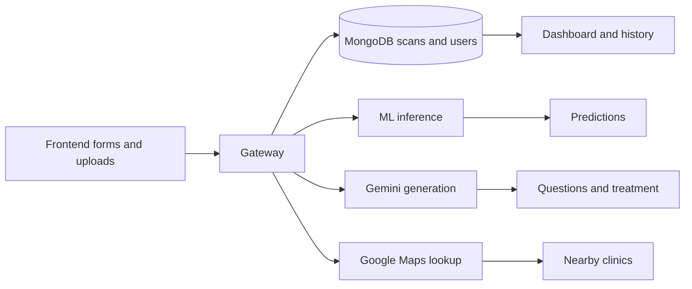

The backend acts as the integration boundary between the browser and the external services.

---

## Design Decisions

### Why this architecture was chosen

The product needs one backend process that can coordinate several different capabilities. A modular Flask app gives that coordination without forcing a microservice deployment overhead.

### Why components are separated

Auth, LLM, clinic lookup, and ML are different concerns with different dependencies. Separate modules keep the codebase easier to reason about and easier to replace later.

### Why these libraries were used

* Flask for the HTTP layer
* PyMongo for MongoDB access
* Flask-CORS for browser integration
* Flask-SocketIO for real-time support hooks where needed

---

## Performance Considerations

* the gateway keeps request fan-out explicit and limited
* scan results can be persisted separately from live analysis
* clinic search uses in-memory TTL caching to avoid repeated Maps calls
* token verification and auth checks are lightweight

The biggest performance costs are external: ML inference, Gemini latency, and Maps API latency.

---

## Scalability Considerations

The backend can scale horizontally at the Flask process level, but some shared state is still process-local.

Potential bottlenecks include:

* MongoDB connection pressure
* in-memory caches not shared across workers
* long-running inference or external API calls

Future improvements could include a shared cache backend, async task handling, and request timing metrics.

---

## Reliability and Error Handling

The backend is designed to keep the user moving even when one dependency fails.

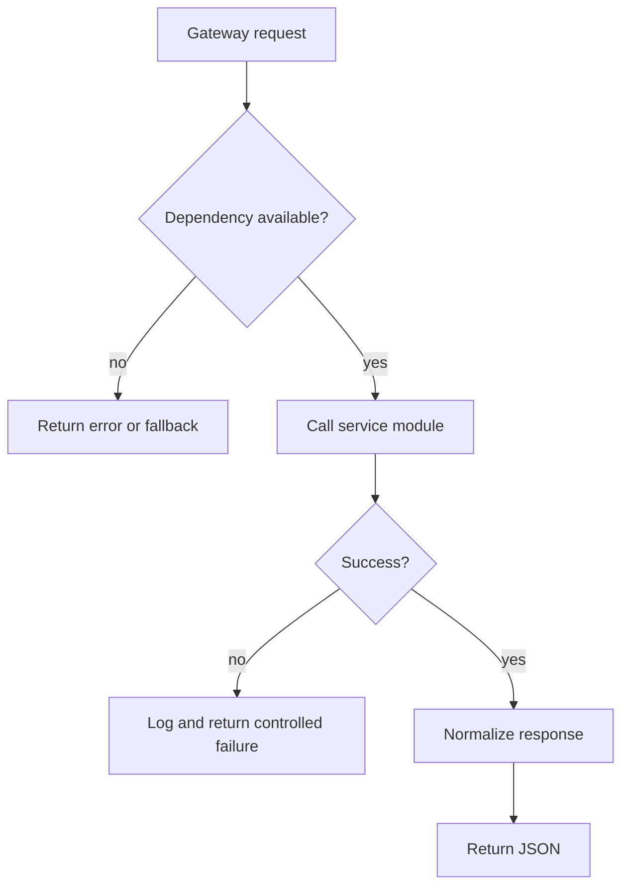

Examples of controlled fallbacks:

* if clinic lookup fails, the rest of the scan history remains intact
* if LLM parsing fails, the gateway can still return predictions
* if auth fails, protected routes reject the request instead of crashing

---

## External Dependencies

* MongoDB
* Google Gemini
* Google Maps APIs
* PyTorch model assets fetched for ML inference
* browser-facing frontend running on Next.js

---

## Project Structure

```text
backend/
├── app.py
│   Purpose: Flask app factory / dev entry point
├── gateway.py
│   Purpose: public API orchestration layer
├── home.py
│   Purpose: root response
├── config.py
│   Purpose: shared configuration and secrets
├── wsgi.py
│   Purpose: production entry point
├── utils/
│   Purpose: shared helpers and TTL cache
└── services/
    Purpose: auth, clinic, llm, and ml modules
```

---

## Request Journey

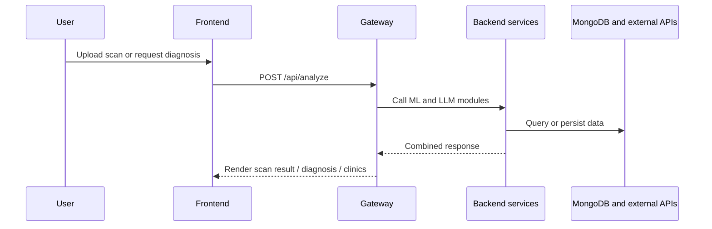

---

### `home.py`

#### Responsibility

Provide a standalone Streamlit prototype / alternate UI path.

#### Why It Exists

It appears to be a separate exploratory interface rather than the main production backend entrypoint.

---

### `utils/cache.py`

#### Responsibility

Provide a simple shared TTL cache and token blacklist store.

#### Why It Exists

The clinic service and auth refresh logic both benefit from lightweight in-memory state without adding external infrastructure.

---

## End-to-End Flow

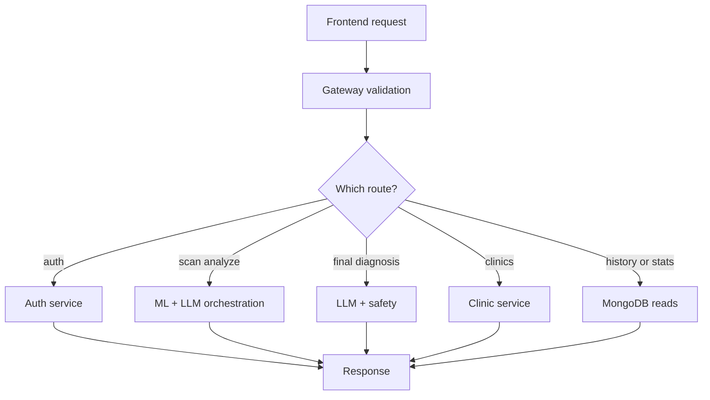

### Step-by-step

1. The frontend calls one of the backend endpoints.
2. The gateway validates request shape and authentication where needed.
3. Requests are routed to the correct service or helper logic.
4. External APIs and MongoDB are consulted when necessary.
5. The gateway normalizes the final payload for the frontend.

---

## Internal Workflows

### Scan orchestration flow

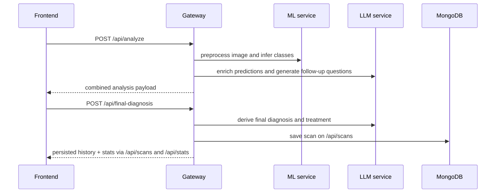

### Clinic lookup flow

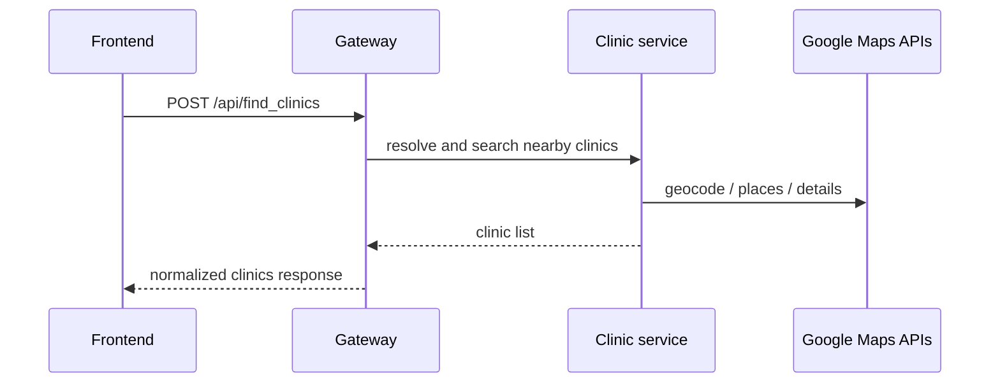

These are the only product-level orchestration workflows in this backend.

---

## Data Flow

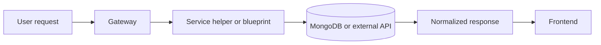

The backend receives raw requests, transforms them through service-specific logic, and returns predictable JSON to the client.

---

## Lifecycle Analysis

### Before processing

* CORS rules are established
* secrets and API keys are loaded from the environment
* blueprints are registered

### During processing

* routes validate input and authentication
* ML and LLM helpers execute their task-specific work
* scan history is written or read from MongoDB

### After processing

* JSON payloads are returned to the frontend
* cookies remain attached where auth is involved
* scan records are available for the dashboard

### Error scenarios

* invalid auth -> `401`
* bad request data -> `400`
* missing external service key -> `500` or fallback behavior depending on route
* unexpected failure -> centralized error handler returns JSON

---

## Design Decisions

### Why this architecture was chosen

The backend uses a gateway-plus-blueprints model because the app needs both separation of concerns and a single request entrypoint.

### Why components are separated

* auth should be independent from clinic lookup
* ML inference should not know about MongoDB history writes
* LLM generation should remain behind a thin wrapper and safety layer

### Why specific libraries were used

* Flask is sufficient for a route-centric orchestration API
* MongoDB suits flexible user and scan documents
* CORS is required because the frontend runs in a separate origin

---

## Performance Considerations

* model loading is cached inside the ML service
* clinic lookup uses in-memory TTL caching
* scan reads are limited and query-by-user, not full-table scans
* tokens are stateless for normal verification

The main backend bottlenecks are external API calls and ML inference, not the gateway routing code itself.

---

## Scalability Considerations

### Current scaling model

The gateway can scale horizontally if the shared state remains in MongoDB and caches are either tolerant of per-instance scope or moved to a shared store.

### Potential bottlenecks

* repeated model initialization if the ML worker is not warm
* Google Maps quota and latency
* MongoDB read/write pressure for scan history

### Horizontal scaling opportunities

* run multiple backend workers
* externalize caches if multi-instance consistency becomes important
* add asynchronous processing for non-interactive enrichment jobs

---

## Reliability and Error Handling

### Validation strategy

The gateway and service routes reject malformed requests early, before expensive work begins.

### Failure handling

* auth failures return structured `401` responses
* missing scan data returns controlled `400` errors
* service-level exceptions are caught and surfaced as JSON where possible

### Recovery paths

* expired access token -> refresh flow
* missing clinic key -> graceful clinic error
* missing model file -> redownload on demand inside ML service

---

## External Dependencies

* MongoDB for users and scans
* Google Gemini for LLM generation
* Google Maps / Places for clinic search
* PyTorch model artifact for ML inference
* environment variables for secrets and service URLs

---

## Project Structure

```text
backend/
├── gateway.py
│   Purpose: main Flask API and orchestration layer
│   Relationship: registers all blueprints and exposes scan/history endpoints
├── config.py
│   Purpose: shared runtime configuration
│   Relationship: imported by every backend module
├── app.py
│   Purpose: local launcher entrypoint
│   Relationship: imports the Flask app from gateway.py
├── wsgi.py
│   Purpose: deployment entrypoint
│   Relationship: used by WSGI servers
├── home.py
│   Purpose: alternate prototype UI path
│   Relationship: standalone exploratory flow
├── services/
│   Purpose: auth, ML, LLM, and clinic subservices
│   Relationship: mounted by the gateway
├── utils/
│   Purpose: shared TTL cache implementation
│   Relationship: used by auth and clinic services
└── README.md
    Purpose: backend design document
```

---

## Request Journey

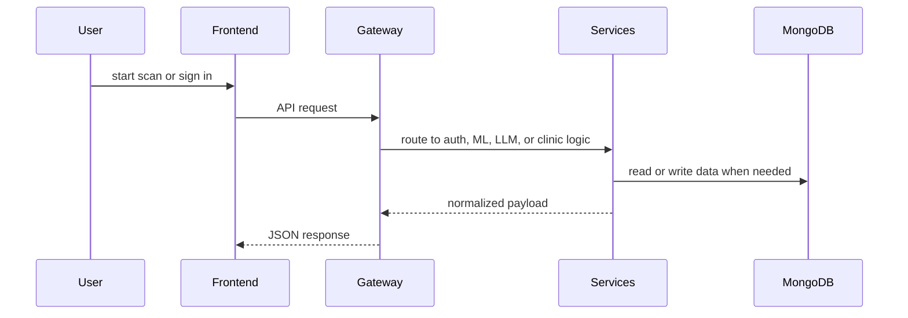

