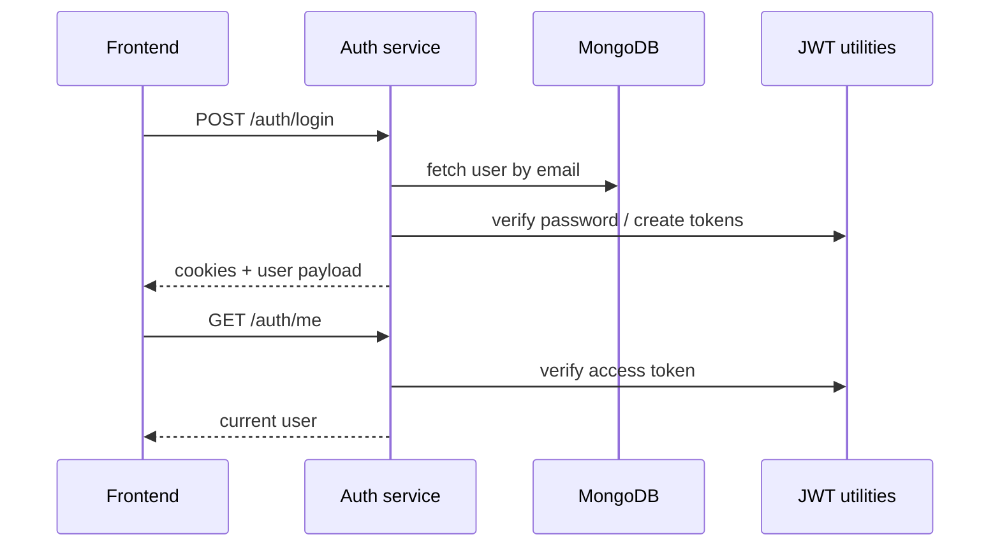
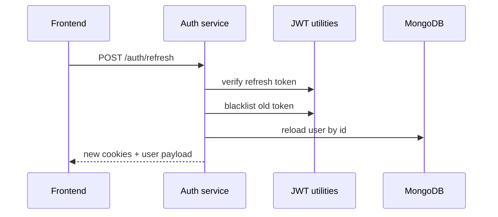
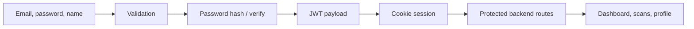
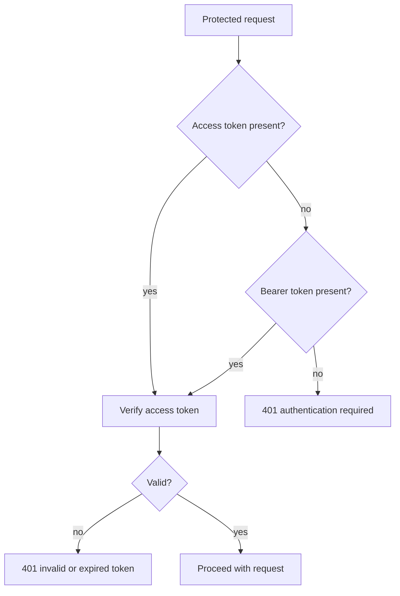
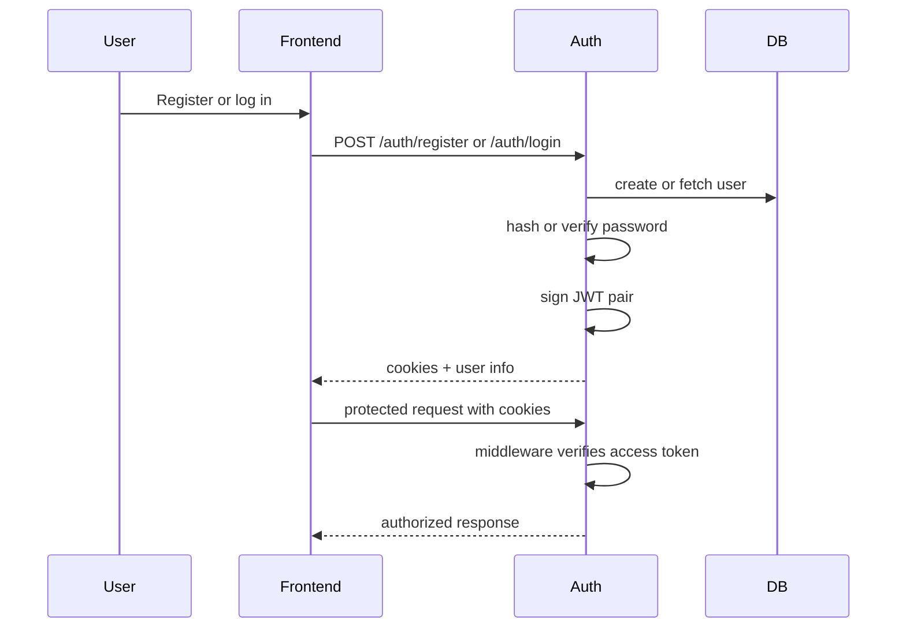

# Auth Service

## Service Overview

The auth service is the identity boundary for Adermis. It exists so the rest of the platform can assume a signed-in user, while this service takes responsibility for credential validation, token issuance, session rotation, and profile maintenance.

### Purpose

Manage user registration and session state.

### Problem Solved

The application needs a secure way to distinguish anonymous visitors from returning users, protect private scan history, and support account recovery without exposing passwords or tokens to client-side code.

### Business Value

Authentication unlocks dashboard history, persisted scans, and personalized care flows while keeping the user session simple enough for the frontend to consume.

### Main Responsibilities

* create users
* verify credentials
* issue access and refresh tokens
* refresh and revoke sessions
* expose the signed-in user to protected routes
* let users update their profile

---

## Architecture Overview

```mermaid
flowchart TD
  # Auth Service

  This service owns identity and session management for Adermis. It is the gatekeeper for user registration, login, session refresh, logout, and profile updates.

  The design goal is simple: keep authentication logic out of the scan, ML, and LLM flows so the rest of the product can trust one consistent user identity layer.

  ---

  ## Service Overview

  ### Purpose

  Provide secure user authentication and authenticated profile access.

  ### Problem Solved

  The application needs a way to remember who is using the product, keep sessions alive safely, and protect scan history and profile routes from anonymous access.

  ### Business Value

  Authentication makes the rest of the experience persistent. Without it, users could not return to prior scans, manage their profile, or rely on a secure dashboard history.

  ### Main Responsibilities

  * register new users
  * verify credentials on login
  * mint short-lived access tokens and longer-lived refresh tokens
  * secure session state through HttpOnly cookies
  * rotate and blacklist refresh tokens
  * expose the current authenticated user
  * allow limited profile updates

  ---

  ## Architecture Overview

  ```mermaid
  flowchart TD
    A[Register / Login request] --> B[Validate payload]
    B --> C[Bcrypt password hash or check]
    C --> D[Create access token]
    C --> E[Create refresh token]
    D --> F[Set HttpOnly cookie]
    E --> F
    F --> G[Authenticated browser session]
    G --> H[Protected route]
    H --> I[require_auth middleware]
    I --> J[Attach user info to flask.g]
  ```

  This service is deliberately cookie-based rather than token-in-local-storage based. That reduces exposure to client-side script access and keeps session handling aligned with browser security defaults.

  ---

  ## Component Breakdown

  ### `routes.py`

  #### Responsibility

  Expose the HTTP contract for registration, login, refresh, logout, profile lookup, and profile updates.

  #### Inputs

  * JSON credentials or profile payloads
  * cookies containing access and refresh tokens

  #### Outputs

  * user metadata
  * session cookies
  * authentication errors when validation fails

  #### Internal Workflow

  1. Validate the request body.
  2. Read or verify the current session.
  3. Query MongoDB when user lookup is needed.
  4. Produce or rotate tokens.
  5. Return a minimal response payload.

  #### Why It Exists

  This module is the public API for auth. It keeps the user-facing contract explicit and avoids scattering login logic across the codebase.

  ### `jwt_utils.py`

  #### Responsibility

  Create, verify, and revoke JWTs.

  #### Inputs

  * user identifiers and profile fields
  * refresh tokens to verify or blacklist

  #### Outputs

  * signed access tokens
  * signed refresh tokens
  * decoded payloads

  #### Internal Workflow

  * sign access tokens with the access secret and short expiry
  * sign refresh tokens with a separate secret and longer expiry
  * verify token types before trusting them
  * blacklist revoked refresh tokens in an in-memory cache

  #### Why It Exists

  Separating token logic makes rotation, verification, and expiry policy testable on their own.

  ### `middleware.py`

  #### Responsibility

  Protect authenticated endpoints and attach verified user identity to request context.

  #### Inputs

  * `access_token` cookie
  * `Authorization: Bearer ...` fallback header

  #### Outputs

  * populated `flask.g` user fields
  * a `401` error when auth is missing or invalid

  #### Internal Workflow

  * read the token from cookie or header
  * verify the JWT
  * attach user id, email, and name to request context
  * continue to the wrapped handler

  #### Why It Exists

  It gives the rest of the backend a uniform way to trust the current user without re-implementing token verification in every route.

  ---

  ## End-to-End Flow

  ```mermaid
  flowchart TD
    A[Client submits auth request] --> B{Endpoint}
    B --> C[Register]
    B --> D[Login]
    B --> E[Refresh]
    B --> F[Logout]
    B --> G[Me / update profile]
    C --> H[Bcrypt hash + MongoDB insert]
    D --> I[Bcrypt verify + token issue]
    E --> J[Verify refresh token + rotate]
    F --> K[Blacklist refresh token + clear cookies]
    G --> L[require_auth + user lookup/update]
    H --> M[Set cookies + return user]
    I --> M
    J --> M
    L --> M
  ```

  ### Lifecycle Notes

  #### Before processing

  The service validates required fields and rejects incomplete requests early.

  #### During processing

  Passwords are hashed or verified, MongoDB is queried, and tokens are generated or rotated.

  #### After processing

  The browser receives cookies and the frontend stores only user-facing profile data in state.

  #### Error scenarios

  * missing email or password -> `400`
  * duplicate user -> `409`
  * invalid credentials -> `401`
  * expired or blacklisted token -> `401`
  * unknown user on refresh -> `401`

  ---

  ## Data Flow

  ```mermaid
  flowchart LR
    A[Browser form data] --> B[Validation]
    B --> C[Password hash or verify]
    C --> D[(MongoDB users collection)]
    D --> E[JWT creation / verification]
    E --> F[HttpOnly cookies]
    F --> G[Protected backend routes]
  ```

  The service converts user input into durable identity state and then into browser-session state.

  ---

  ## Design Decisions

  ### Why this architecture was chosen

  JWTs keep the service stateless from the perspective of access-token verification, while MongoDB retains durable user records and refresh-token rotation state.

  ### Why components are separated

  Token handling, route handling, and request authentication solve different problems and change at different rates. Separating them reduces risk when the session policy evolves.

  ### Why these libraries were used

  * Flask provides a lightweight route layer
  * bcrypt is a well-established password hashing approach
  * PyJWT fits the current token-based session design
  * MongoDB stores user records without forcing a rigid schema

  ---

  ## Performance Considerations

  * token verification is fast and does not require database reads for every request
  * the middleware reads only the minimum required token fields
  * refresh token blacklisting uses an in-memory cache for quick checks

  There is no batch processing or async queue in this service.

  ---

  ## Scalability Considerations

  The current model is straightforward to scale horizontally because access-token verification does not depend on local server state.

  Potential bottlenecks include:

  * MongoDB lookups during login and refresh
  * in-memory refresh-token blacklist behavior if deployed across multiple workers without shared state

  Future improvements could include a shared cache or persistent token revocation store.

  ---

  ## Reliability and Error Handling

  The service fails closed: if a token is missing or invalid, the request is rejected.

  ```mermaid
  flowchart TD
    A[Incoming protected request] --> B{Token present?}
    B -- no --> C[401 Authentication required]
    B -- yes --> D{Token valid?}
    D -- no --> E[401 Invalid or expired token]
    D -- yes --> F[Attach user context and continue]
  ```

  Recovery paths are simple:

  * refresh the access token when it expires
  * log in again when both tokens are invalid
  * re-register if the account does not exist

  ---

  ## External Dependencies

  * MongoDB for the `users` collection
  * bcrypt for password hashing
  * PyJWT for token signing and verification

  ---

  ## Project Structure

  ```text
  backend/services/auth/
  ├── routes.py
  │   Purpose: public auth endpoints
  │   Relationship: used by the backend gateway and frontend session flow
  ├── jwt_utils.py
  │   Purpose: token lifecycle management
  │   Relationship: imported by routes.py and middleware.py
  ├── middleware.py
  │   Purpose: protected-route decorator
  │   Relationship: used by dashboard/profile-style endpoints
  └── README.md
    Purpose: service design document
  ```

  ---

  ## Request Journey

  ```mermaid
  sequenceDiagram
    participant U as User
    participant F as Frontend
    participant A as Auth routes
    participant J as jwt_utils
    participant M as middleware
    participant D as MongoDB

    U->>F: Submit login or registration form
    F->>A: POST /auth/login or /auth/register
    A->>D: Read or write user record
    A->>J: Create tokens
    A-->>F: Set cookies + return user data
    F->>M: Request protected route later
    M->>J: Verify access token
    M-->>F: Allow or reject request
  ```
* place user metadata in `flask.g`
* continue to the wrapped handler

#### Why It Exists

This decorator prevents every protected route from re-implementing the same session lookup logic.

---

## End-to-End Flow

```mermaid
flowchart TD
  A[User submits credentials] --> B[Validate request]
  B --> C[Query MongoDB]
  C --> D{Password valid?}
  D -->|no| E[401 invalid credentials]
  D -->|yes| F[Issue access token]
  F --> G[Issue refresh token]
  G --> H[Set HttpOnly cookies]
  H --> I[Return authenticated user]
```

### What happens step by step

1. A user registers or logs in.
2. The service validates required fields.
3. MongoDB is queried for the account or duplicate email.
4. bcrypt is used to hash or verify the password.
5. JWT access and refresh tokens are created.
6. Tokens are written into HttpOnly cookies.
7. The frontend receives a minimal user object.

---

## Internal Workflows

### Authentication flow



### Refresh flow



---

## Data Flow



The service receives identity data, turns it into durable session state, and feeds that state into the rest of the application.

---

## Lifecycle Analysis

### Before processing

* request body or cookies are inspected
* missing credentials are rejected early
* the target user record is resolved when needed

### During processing

* passwords are hashed or compared with bcrypt
* tokens are signed and rotated
* the auth state is attached to the response

### After processing

* cookies are persisted in the browser
* protected endpoints can trust `flask.g`

### Error scenarios

* missing email or password -> `400`
* duplicate registration -> `409`
* invalid password -> `401`
* invalid or expired refresh token -> `401`
* unknown user -> `401`

---

## Design Decisions

### Why this architecture was chosen

JWT cookies provide a simple browser-friendly session model while keeping the backend stateless for access-token verification.

### Why components are separated

* route handlers focus on HTTP semantics
* JWT helpers centralize session rules
* middleware makes authentication reusable across the app

### Why the chosen libraries matter

* Flask keeps the API lightweight
* bcrypt provides password hashing
* PyJWT gives explicit control over token contents and expiry
* MongoDB is a natural fit for user profiles and future session-adjacent documents

---

## Performance Considerations

* token verification is local and fast
* user lookups are indexed by email
* access tokens are short-lived to reduce server work
* refresh rotation avoids storing large session state

There is no queue, async worker, or batch path here. The service is optimized for low-latency request/response authentication.

---

## Scalability Considerations

### Current scaling model

The service scales horizontally because access verification is stateless beyond the token blacklist.

### Potential bottlenecks

* MongoDB access under heavy login or refresh traffic
* refresh-token blacklist growth over long retention windows

### Horizontal scaling opportunities

* add more Flask workers behind a load balancer
* move token blacklist to a shared store if multiple app instances are used
* cache user profile reads if account traffic grows significantly

---

## Reliability and Error Handling

### Validation strategy

The service validates required fields before touching MongoDB or issuing tokens.

### Failure handling

The service returns structured JSON errors instead of leaking stack traces to the client.

### Fallbacks

The middleware accepts both cookies and bearer tokens, which helps with browser and API-client compatibility.

### Recovery paths

* expired access token -> refresh endpoint
* missing refresh token -> reauthenticate
* blacklisted refresh token -> reauthenticate



---

## External Dependencies

* MongoDB users collection
* bcrypt
* PyJWT
* Flask request/response and `flask.g`

---

## Project Structure

```text
backend/services/auth/
├── routes.py
│   Purpose: request handlers for register, login, refresh, logout, me, update-profile
│   Relationship: imports JWT helpers and middleware
├── jwt_utils.py
│   Purpose: encode, decode, and blacklist tokens
│   Relationship: used by routes.py and middleware.py
├── middleware.py
│   Purpose: protect routes with token verification
│   Relationship: wraps authenticated handlers
└── README.md
  Purpose: service design document
```

---

## Request Journey



