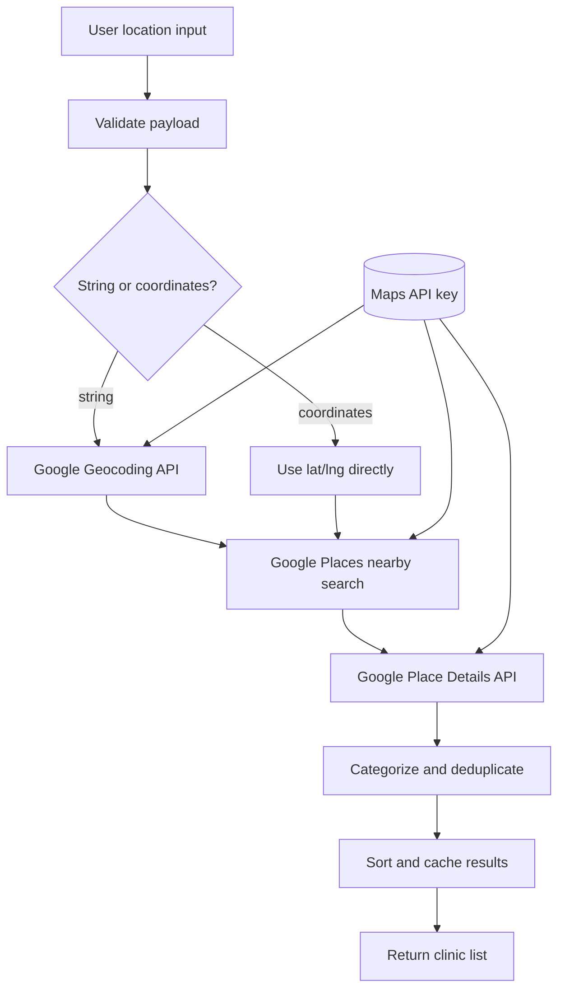
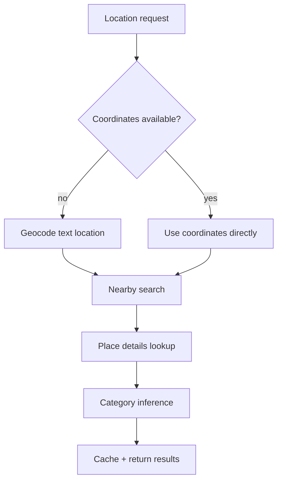
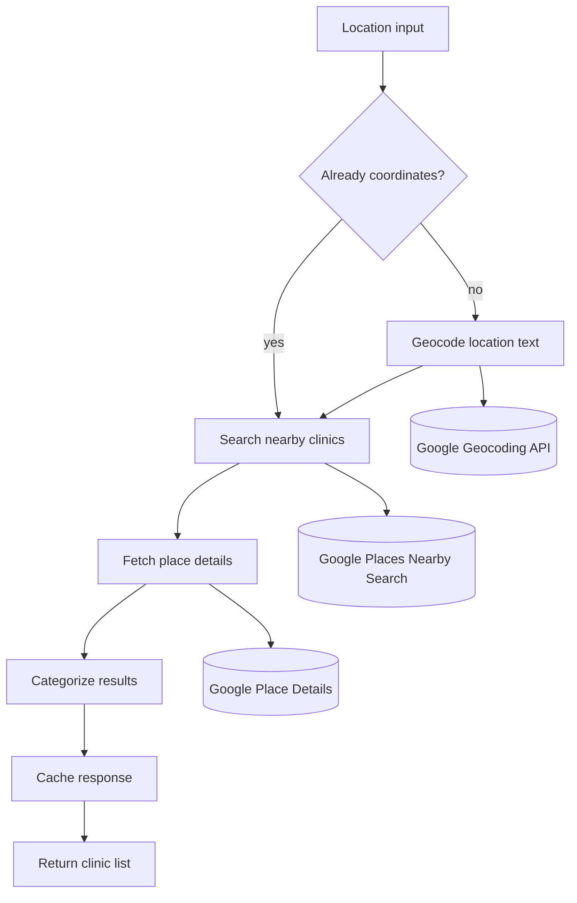
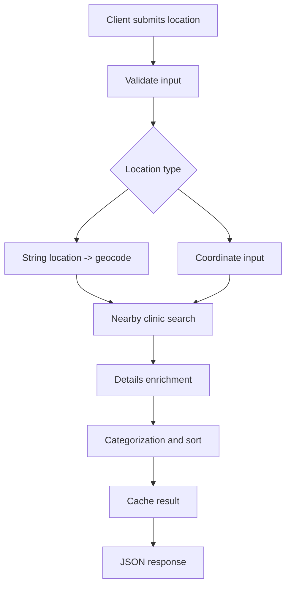
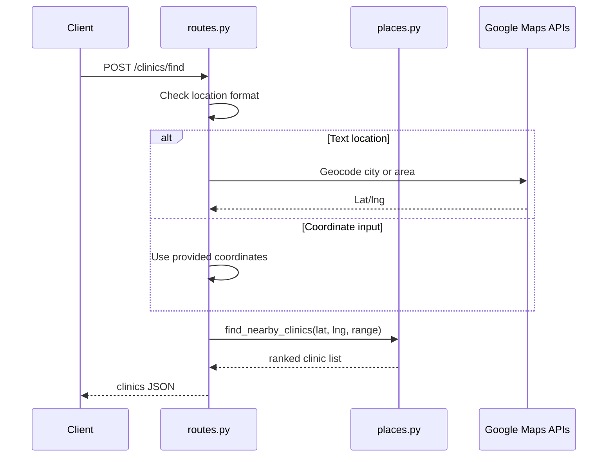
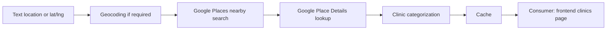
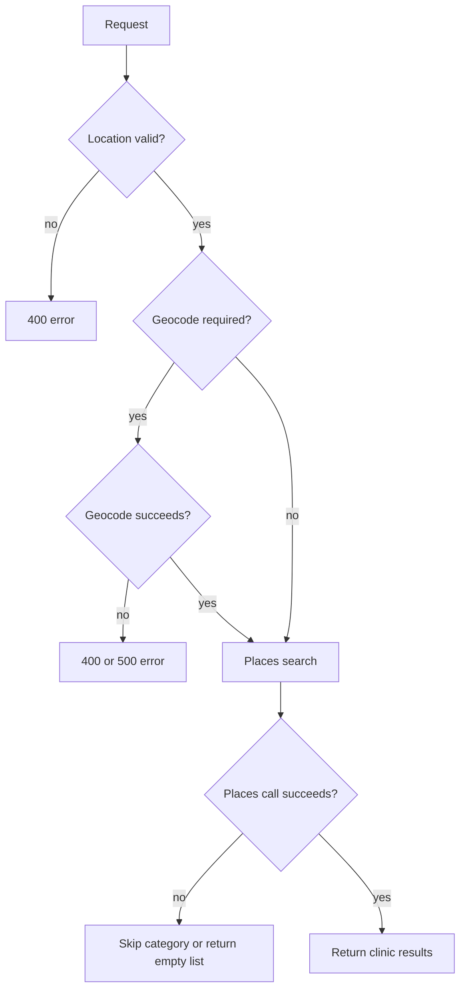
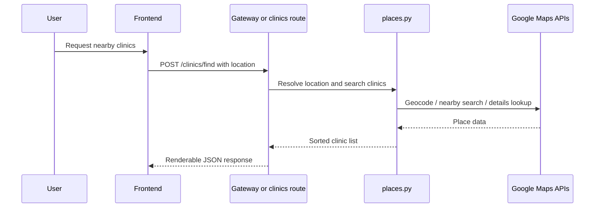
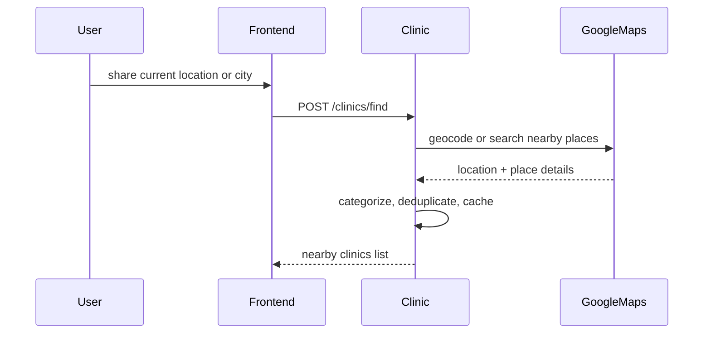

# Clinic Service

## Service Overview

The clinic service is the follow-up action layer for Adermis. Once a skin condition has been identified, this service helps the user find real-world care options nearby.

### Purpose

Return nearby dermatology or healthcare facilities based on the user’s location.

### Problem Solved

An AI diagnosis is only useful if it leads to next steps. This service closes that loop by translating a location into practical care options.

### Business Value

It turns the product from a diagnostic tool into a care-navigation tool, which is especially important when the analysis suggests professional follow-up.

### Main Responsibilities

* accept either coordinates or a location string
* geocode text locations when necessary
* query Google Places for nearby facilities
* fetch richer place details
* categorize and sort results
* cache repeated searches for performance

---

## Architecture Overview



---

## Component Breakdown

### `routes.py`

#### Responsibility

Expose the `/clinics/find` endpoint and normalize request inputs.

#### Inputs

* `location` as either a string or `{lat, lng}` object
* optional search radius in kilometers

#### Outputs

* JSON list of clinics
* clear error responses for missing or invalid locations

#### Internal Workflow

1. validate the request body
2. geocode string locations if needed
3. call the place lookup helper
4. return the resulting clinic list

#### Why It Exists

The route isolates request parsing from external API calls and keeps the service contract simple for the frontend.

---

### `places.py`

#### Responsibility

Perform the actual Google Maps lookups, category inference, deduplication, and caching.

#### Inputs

* latitude and longitude
* search radius
* Maps API key from shared config

#### Outputs

* a list of enriched clinic records

#### Internal Workflow

* build a cache key from rounded coordinates and radius
* check the in-memory cache
* query Google Places Nearby Search for category-specific keywords
* fetch Place Details for contact and hours information
* classify each place as Government, NGO, or Private
* sort and cache the final list

#### Why It Exists

This module packages all external map behavior in one place so the service remains easy to reason about and easy to replace if the provider ever changes.

---

## End-to-End Flow



### Step-by-step

1. The user shares either a city name or a current GPS location.
2. The service validates the request.
3. If the input is text, Google Geocoding converts it to coordinates.
4. Google Places Nearby Search finds nearby hospitals and clinics.
5. Place Details enriches the results with address, phone, website, and hours.
6. The service classifies clinics by name keyword and deduplicates them.
# Clinic Service

This service turns a diagnosis into an action step. Once Adermis identifies a likely skin condition, this service helps the user find nearby dermatology clinics, hospitals, and healthcare providers.

The service is location-oriented, not identity-oriented. It does not need user accounts or scan history to work; it only needs a location and a search radius.

---

## Service Overview

### Purpose

Find nearby healthcare locations relevant to skin care.

### Problem Solved

Users need a fast way to move from “what might this be?” to “where can I go next?” This service creates that bridge.

### Business Value

It makes the scan flow actionable. Instead of ending at a label, the product can immediately suggest a next step in care.

### Main Responsibilities

* accept coordinates or a textual location
* geocode location text when necessary
* query Google Places for nearby facilities
* fetch richer place details
* infer a simple clinic category
* cache results for repeated searches

---

## Architecture Overview



This service sits at the edge of the product and is fully dependent on Google Maps APIs for its data.

---

## Component Breakdown

### `routes.py`

#### Responsibility

Expose the clinic-search endpoint and normalize the input format.

#### Inputs

* JSON payload with `location` and optional `range`

#### Outputs

* JSON array of clinic objects

#### Internal Workflow

1. Validate that a location exists.
2. Geocode string locations when needed.
3. Pass numeric coordinates to the search helper.
4. Return the clinic list as JSON.

#### Why It Exists

This route is the public API contract and keeps the frontend from dealing with geocoding or Places API complexity directly.

### `places.py`

#### Responsibility

Talk to Google Places, enrich results, categorize them, and cache the output.

#### Inputs

* latitude and longitude
* radius in kilometers

#### Outputs

* a sorted list of enriched clinic records

#### Internal Workflow

* check the local cache first
* call Places Nearby Search with type and keyword filters
* fetch Place Details for phone number, website, address, and hours
* deduplicate by place ID
* categorize each place as Government, NGO, or Private
* sort results by category preference
* cache the final list

#### Why It Exists

It isolates external API logic from the route layer and keeps the data enrichment strategy maintainable.

---

## End-to-End Flow



### Lifecycle Notes

#### Before processing

The service checks that the request includes some form of location.

#### During processing

The service resolves text locations, calls Google Places, and enriches each result.

#### After processing

The final list is cached and returned to the caller.

#### Error scenarios

* missing location -> `400`
* missing Maps API key for text geocoding -> `500`
* geocoding failure -> `400`
* external request timeout or failure -> partial or empty result set

---

## Internal Workflows

### Location resolution flow



This service has no authentication, payment, or background-job workflow.

---

## Data Flow



The output is a presentation-ready list rather than raw geospatial data.

---

## Design Decisions

### Why this architecture was chosen

The user only needs a small, direct answer: where should I go next? A dedicated service keeps that logic focused and easy to swap out if the search provider changes.

### Why components are separated

Route handling, geocoding, enrichment, and categorization change for different reasons. Separating them reduces the chance of breaking the endpoint while tuning the search logic.

### Why these libraries were used

* Flask provides the request/response boundary
* requests handles simple outbound HTTP calls to Google APIs
* the shared TTL cache improves repeated lookups without external infrastructure

---

## Performance Considerations

* results are cached for 5 minutes
* repeated nearby searches reuse the same cached payload
* place details are only fetched for candidate results
* duplicate place IDs are filtered before returning data

There is no async execution path in the current implementation; performance relies on cache hit rate and restrained API usage.

---

## Scalability Considerations

The service can scale horizontally because the request is stateless from the client perspective.

Potential bottlenecks include:

* Google API latency
* rate limits on external Maps services
* in-memory cache isolation across multiple workers

Future improvements could include shared caching and request coalescing for popular locations.

---

## Reliability and Error Handling

The service degrades gracefully when external APIs fail.



Recovery paths:

* retry with a wider range
* re-enable location permissions
* provide explicit coordinates instead of free-text location

---

## External Dependencies

* Google Geocoding API
* Google Places Nearby Search API
* Google Place Details API
* shared in-memory TTL cache from `utils/cache.py`

---

## Project Structure

```text
backend/services/clinic/
├── routes.py
│   Purpose: public clinic-search endpoint
│   Relationship: called by the frontend clinics page and backend gateway
├── places.py
│   Purpose: Google Maps API orchestration and sorting
│   Relationship: used by routes.py
└── README.md
  Purpose: service design document
```

---

## Request Journey



### Why components are separated

* request handling should stay in `routes.py`
* Google API logic belongs in `places.py`
* caching should be reusable and isolated from the HTTP layer

### Why the chosen libraries were used

* Requests is sufficient for the external HTTP APIs
* Flask keeps the endpoint lightweight
* The shared TTL cache provides low-cost reuse without introducing Redis for a small deployment footprint

---

## Performance Considerations

* results are cached for 5 minutes
* coordinates are rounded before cache lookup to increase reuse
* repeated geocoding is avoided when coordinates are already available
* only a compact list of clinics is returned, not raw Google payloads

This service is network-bound, so caching is the main performance optimization.

---

## Scalability Considerations

### Current scaling model

The service scales as a stateless HTTP lookup layer with local memory cache.

### Potential bottlenecks

* Google API latency
* rate limits on Places requests
* duplicated work across multiple backend workers

### Horizontal scaling opportunities

* move cache to a shared store
* pre-aggregate clinic results for common urban regions
* add request throttling when API quotas become a concern

---

## Reliability and Error Handling

### Validation strategy

The service checks for location presence and format before making external calls.

### Failure handling

If geocoding or nearby search fails, the service returns a structured error or skips the failed category instead of crashing the whole request.

### Retry mechanisms

The service does not implement internal retries. It relies on the caller to retry or on the next user action.

### Fallbacks

* cached results are used when available
* if one category of search fails, the others can still return

---

## External Dependencies

* Google Geocoding API
* Google Places Nearby Search API
* Google Place Details API
* shared Maps API key in `config.py`
* in-memory TTL cache from `utils/cache.py`

---

## Project Structure

```text
backend/services/clinic/
├── routes.py
│   Purpose: handle /clinics/find requests and normalize inputs
│   Relationship: delegates to places.py
├── places.py
│   Purpose: query and enrich Google Places results
│   Relationship: uses shared cache and Maps API key
└── README.md
  Purpose: service design document
```

---

## Request Journey



