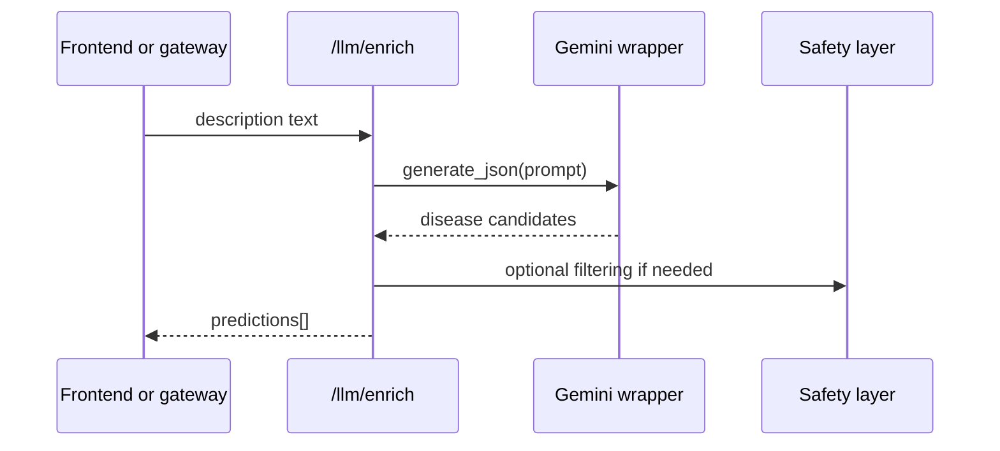
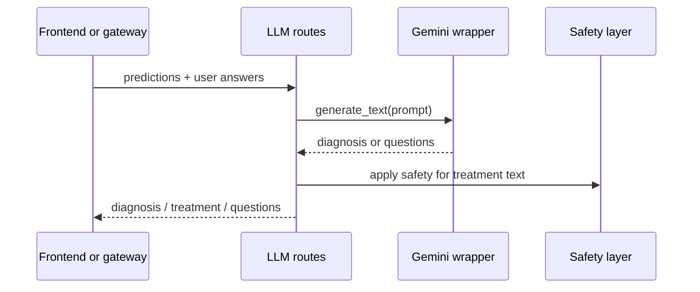
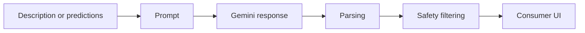
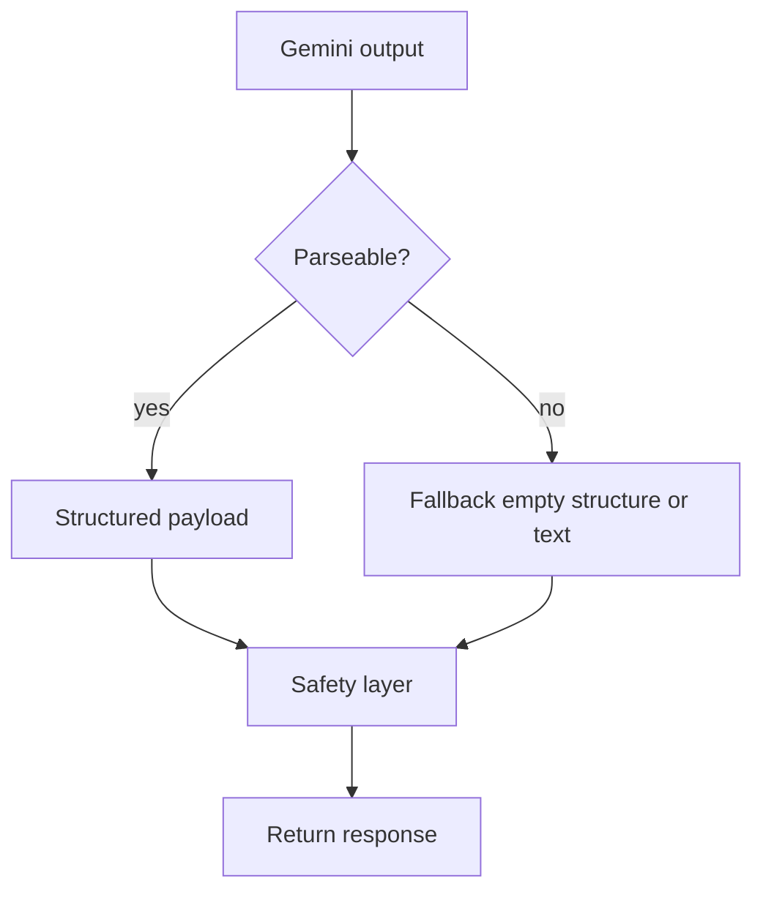
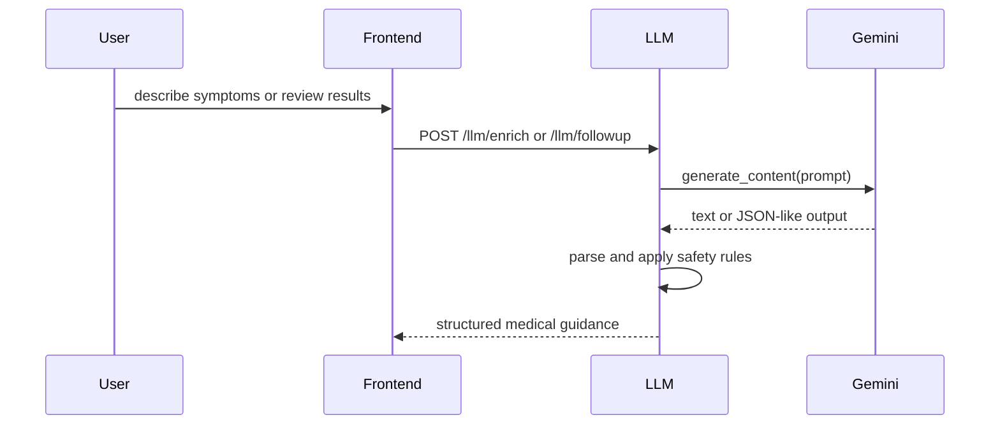

# LLM Service

## Service Overview

This service is the language-generation layer of Adermis. It translates machine-learning predictions into patient-facing explanation, follow-up questions, final-diagnosis text, and treatment guidance.

### Purpose

Convert structured AI signals into readable medical guidance.

### Problem Solved

The ML service can rank diseases, but that output is not enough for a user experience. This layer turns sparse prediction data into a guided conversation with context, next steps, and safety controls.

### Business Value

It makes the diagnosis flow understandable to a non-technical user and gives the frontend content to render for analysis, follow-up, and treatment pages.

### Main Responsibilities

* enrich text descriptions into disease candidates
* generate follow-up medical questions
* resolve the final diagnosis from predictions and answers
* generate structured treatment content
* filter or annotate unsafe model output

---

## Architecture Overview

```mermaid
flowchart TD
  A[Prediction list or patient description] --> B[Prompt construction]
  B --> C[Google Gemini 2.0 Flash]
  C --> D[Text or JSON parsing]
  D --> E[Safety layer]
  # LLM Service

  This service is the language layer of Adermis. It does not diagnose skin disease by itself; instead, it takes outputs from the ML layer and user-provided descriptions or answers, then turns them into readable, safety-filtered medical text.

  Its job is to make the ML result understandable and actionable without exposing raw prompt logic to the frontend.

  ---

  ## Service Overview

  ### Purpose

  Transform prediction data and user symptom descriptions into structured medical guidance.

  ### Problem Solved

  The ML model returns rankings, not explanations. Users need plain language: likely conditions, follow-up questions, a final summary, and treatment guidance.

  ### Business Value

  The service turns a technical prediction into a human-friendly workflow that feels like a guided consultation rather than a raw classifier output.

  ### Main Responsibilities

  * enrich free-text descriptions into candidate diseases
  * generate follow-up questions that narrow the diagnosis
  * determine a final likely disease from predictions plus answers
  * generate treatment text for a named condition
  * filter unsafe or overly specific medical output

  ---

  ## Architecture Overview

  ```mermaid
  flowchart TD
    A[Text description or prediction list] --> B[Prompt builder]
    B --> C[Google Gemini 2.0 Flash]
    C --> D[Text or JSON parsing]
    D --> E[Safety layer]
    E --> F[Frontend-ready output]

    E --> G[Medical disclaimer]
    E --> H[Dosage warning if needed]
  ```

  The service uses Gemini as a generator, but it owns the prompt boundaries, output format, and safety rules.

  ---

  ## Component Breakdown

  ### `routes.py`

  #### Responsibility

  Expose the HTTP interface for enrichment, follow-up, final diagnosis, and treatment generation.

  #### Inputs

  * JSON payloads containing descriptions, predictions, or user answers

  #### Outputs

  * prediction arrays
  * follow-up question lists
  * final disease strings
  * structured treatment text

  #### Internal Workflow

  1. Validate the request body.
  2. Build the appropriate prompt.
  3. Call the Gemini wrapper.
  4. Parse the response into the expected shape.
  5. Apply the safety layer when the response is treatment-related.

  #### Why It Exists

  It keeps the HTTP contract stable while allowing prompt engineering and safety rules to evolve underneath.

  ### `gemini.py`

  #### Responsibility

  Wrap the Google Gemini SDK in a small helper API.

  #### Inputs

  * prompt text

  #### Outputs

  * plain text
  * parsed JSON-like structures

  #### Internal Workflow

  * configure Gemini using the shared API key
  * call the `gemini-2.0-flash` model
  * trim response text
  * strip code fences when parsing structured output
  * return empty data if parsing fails

  #### Why It Exists

  The wrapper centralizes model access and shields route handlers from SDK details and malformed formatting.

  ### `safety.py`

  #### Responsibility

  Apply conservative medical safety rules to generated content.

  #### Inputs

  * raw Gemini response text

  #### Outputs

  * filtered or annotated response text

  #### Internal Workflow

  * detect harmful keywords
  * block unsafe output when necessary
  * flag dosage-like language
  * append a medical disclaimer for treatment text

  #### Why It Exists

  The LLM output appears directly in the product UI. A safety layer reduces the chance of overconfident or inappropriate guidance reaching the user.

  ---

  ## End-to-End Flow

  ```mermaid
  flowchart TD
    A[Incoming request] --> B{Which endpoint?}
    B --> C[/llm/enrich/]
    B --> D[/llm/followup/]
    B --> E[/llm/final-diagnosis/]
    B --> F[/llm/treatment/]
    C --> G[Prompt description -> disease ranking]
    D --> H[Prompt predictions -> follow-up questions]
    E --> I[Prompt predictions + answers -> final diagnosis]
    F --> J[Prompt disease name -> treatment guidance]
    G --> K[Parse JSON]
    H --> L[Parse line list]
    I --> M[Generate risk + treatment text]
    J --> N[Apply safety]
    M --> N
    N --> O[JSON response]
  ```

  ### Lifecycle Notes

  #### Before processing

  The service checks that the required field is present for the requested endpoint.

  #### During processing

  It constructs a constrained prompt, invokes Gemini, and interprets the response format.

  #### After processing

  The response is normalized and, when appropriate, filtered through safety rules before being sent back.

  #### Error scenarios

  * missing description or disease -> `400`
  * Gemini API error -> `500`
  * malformed JSON from the model -> fallback to empty or safe defaults

  ---

  ## Internal Workflows

  ### Enrichment flow

  ```mermaid
  sequenceDiagram
    participant F as Frontend or gateway
    participant R as routes.py
    participant G as gemini.py
    participant S as safety.py

    F->>R: POST /llm/enrich with description
    R->>G: generate_json(prompt)
    G-->>R: list of candidate diseases
    R-->>F: predictions array
  ```

  ### Follow-up flow

  ```mermaid
  sequenceDiagram
    participant F as Frontend or gateway
    participant R as routes.py
    participant G as gemini.py

    F->>R: POST /llm/followup with predictions
    R->>G: generate_text(prompt)
    G-->>R: numbered or line-separated questions
    R-->>F: cleaned questions list
  ```

  ### Final diagnosis flow

  ```mermaid
  sequenceDiagram
    participant F as Frontend or gateway
    participant R as routes.py
    participant G as gemini.py
    participant S as safety.py

    F->>R: POST /llm/final-diagnosis with predictions and answers
    R->>G: determine final disease
    R->>G: determine risk level
    R->>G: generate treatment text
    R->>S: apply safety filtering
    R-->>F: disease, risk_level, treatment
  ```

  This service has no payment, search, or authentication workflow.

  ---

  ## Data Flow

  ```mermaid
  flowchart LR
    A[User description or prediction list] --> B[Prompt assembly]
    B --> C[Gemini generation]
    C --> D[Text / JSON parsing]
    D --> E[Safety filter]
    E --> F[Structured response]
  ```

  The service consistently transforms semi-structured AI output into frontend-consumable data.

  ---

  ## Design Decisions

  ### Why this architecture was chosen

  Using a separate LLM service keeps prompt logic out of the gateway and makes future prompt tuning much safer.

  ### Why components are separated

  Prompting, response parsing, and safety concerns change independently. Separating them reduces regression risk and makes each concern testable in isolation.

  ### Why these libraries were used

  * Google Gemini is used for natural-language generation
  * Flask provides the HTTP route layer
  * standard JSON handling supports structured predictions and treatment text

  ---

  ## Performance Considerations

  * Gemini is configured once from shared config
  * the wrapper avoids repeated SDK setup in each route
  * JSON parsing is lightweight and the service returns only the data the frontend needs

  There is no caching layer here today; the main optimization is minimizing unnecessary prompt/response work.

  ---

  ## Scalability Considerations

  The service is stateless at the request level, so it can be scaled horizontally with multiple Flask workers.

  Potential bottlenecks include:

  * external Gemini latency
  * prompt length growth
  * repeated generation for similar questions or treatment text

  Future improvements could include response caching for repeated prompts and explicit request timing metrics.

  ---

  ## Reliability and Error Handling

  The service prefers safe failure over speculative output.

  ```mermaid
  flowchart TD
    A[Request] --> B{Input valid?}
    B -- no --> C[400 error]
    B -- yes --> D{Gemini succeeds?}
    D -- no --> E[500 error or fallback default]
    D -- yes --> F{Parse succeeds?}
    F -- no --> G[Empty list or safe fallback]
    F -- yes --> H[Apply safety and return response]
  ```

  Fallback behavior includes:

  * returning an empty list for malformed JSON
  * using default questions when prompt generation fails
  * using the top prediction as a fallback diagnosis when Gemini cannot decide

  ---

  ## External Dependencies

  * Google Gemini API
  * the `gemini-2.0-flash` model
  * shared API key from `config.py`

  ---

  ## Project Structure

  ```text
  backend/services/llm/
  ├── gemini.py
  │   Purpose: model wrapper and JSON/text helpers
  │   Relationship: used by routes.py
  ├── safety.py
  │   Purpose: content filtering and disclaimer logic
  │   Relationship: used before returning treatment text
  ├── routes.py
  │   Purpose: public HTTP API
  │   Relationship: called by the gateway and frontend
  └── README.md
    Purpose: service design document
  ```

  ---

  ## Request Journey

  ```mermaid
  sequenceDiagram
    participant U as User
    participant F as Frontend
    participant G as Gateway
    participant R as LLM routes
    participant GM as Gemini wrapper
    participant S as Safety layer

    U->>F: Describe symptoms or review scan output
    F->>G: POST /api/analyze or /api/final-diagnosis
    G->>R: Forward enrichment or treatment request
    R->>GM: Generate text or JSON
    R->>S: Filter treatment output when needed
    R-->>G: Structured response
    G-->>F: Renderable diagnosis or treatment payload
  ```

#### Outputs

* filtered text with a disclaimer or dosage warning when needed

#### Internal Workflow

* scan for harmful keywords
* scan for dosage-like language
* append a disclaimer to treatment content

#### Why It Exists

The service is used for medical-adjacent output, so safety controls are part of the product boundary rather than optional formatting.

---

## End-to-End Flow

```mermaid
flowchart TD
  A[Request received] --> B[Validate input]
  B --> C[Select prompt template]
  C --> D[Call Gemini]
  D --> E{Structured JSON expected?}
  E -- yes --> F[Parse JSON]
  E -- no --> G[Use text directly]
  F --> H[Apply safety layer]
  G --> H
  H --> I[Return response]
```

### Step-by-step

1. The client sends a text description, predictions, answers, or a disease name.
2. The route validates the request payload.
3. A prompt is assembled for the exact task.
4. Gemini generates a response.
5. The service parses JSON when the route expects structured data.
6. The safety layer filters and annotates treatment output.
7. The final response is returned to the caller.

---

## Internal Workflows

### Enrichment flow



### Follow-up and final-diagnosis flow



Only these workflows exist in this service: enrichment, follow-up, final diagnosis, and treatment generation.

---

## Data Flow



The service transforms loose input into highly structured, presentation-ready output.

---

## Lifecycle Analysis

### Before processing

* the request payload is checked
* the task type determines the prompt shape
* Gemini is ready through shared configuration

### During processing

* prompts constrain the model output format
* JSON is parsed defensively
* unsafe or dosage-like output is filtered

### After processing

* the frontend receives either structured data or markdown-like text
* treatment responses include disclaimers

### Error scenarios

* missing description or disease name -> `400`
* Gemini request failure -> `500` or fallback response
* malformed JSON from Gemini -> empty list or fallback text

---

## Design Decisions

### Why this architecture was chosen

The LLM is isolated behind a wrapper and safety layer so prompt logic, parsing, and medical caution are explicit rather than scattered across route handlers.

### Why components are separated

* prompts evolve frequently and should not be mixed with HTTP glue
* parsing behavior needs to be shared across routes
* safety rules should apply consistently to all treatment text

### Why the chosen libraries were used

* Google Gemini provides general-purpose generation for descriptions and treatment text
* Flask keeps the service simple and route-based
* JSON parsing is handled in Python so downstream consumers get predictable payloads

---

## Performance Considerations

* the Gemini model client is created centrally instead of per route file
* JSON parsing is lightweight and local
* the safety layer is string-based and cheap to apply
* the service returns only the content needed for the next UI step

There is no batching or async job queue here. Latency is dominated by the external Gemini call.

---

## Scalability Considerations

### Current scaling model

The service scales as a stateless HTTP API, with the external LLM call being the primary bottleneck.

### Potential bottlenecks

* Gemini rate limits
* slow model responses
* large prompt payloads

### Horizontal scaling opportunities

* run multiple Flask workers
* cache repeated prompt outputs if product requirements allow it
* move heavy prompt generation to background jobs for non-interactive use cases

---

## Reliability and Error Handling

### Validation strategy

Routes reject empty required fields early.

### Failure handling

The service catches generation and parsing failures and returns either a structured error or a controlled fallback.

### Retry mechanisms

There is no built-in retry logic. The caller can retry if the external model call fails.

### Recovery paths

* malformed JSON -> return empty list
* generation failure during final diagnosis -> fall back to the top prediction
* generation failure during treatment -> return a safe human-readable message



---

## External Dependencies

* Google Gemini API
* shared `GOOGLE_API_KEY` from configuration
* Flask
* Python JSON parsing

---

## Project Structure

```text
backend/services/llm/
├── routes.py
│   Purpose: expose /llm/enrich, /llm/followup, /llm/final-diagnosis, /llm/treatment
│   Relationship: calls the Gemini wrapper and safety layer
├── gemini.py
│   Purpose: configure Gemini and normalize generation output
│   Relationship: used by every route
├── safety.py
│   Purpose: block harmful output and inject disclaimers
│   Relationship: applied to treatment-oriented responses
└── README.md
  Purpose: service design document
```

---

## Request Journey



