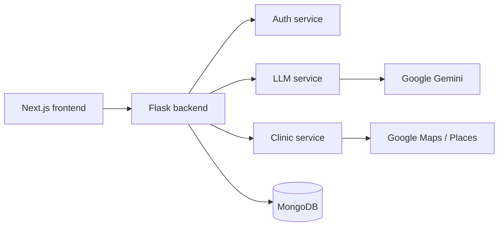
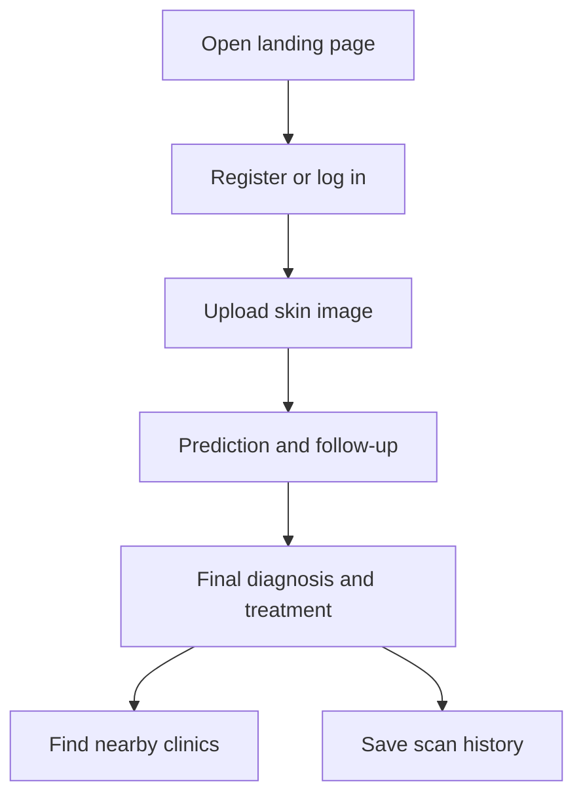

# Adermis

Adermis is a skin-disease screening product built from a Next.js frontend and a Flask backend. This root README is the entry index for the implementation docs and system overview.

---

## Documentation Index

* [Project overview](Adermis-main/README.md)
* [Backend platform](Adermis-main/backend/README.md)
* [Frontend app](Adermis-main/adermis/README.md)
* [Auth service](Adermis-main/backend/services/auth/README.md)
* [LLM service](Adermis-main/backend/services/llm/README.md)
* [Clinic service](Adermis-main/backend/services/clinic/README.md)

---

## What The System Does

The application guides a user from upload to outcome: authenticate, upload a skin image, review ranked predictions, answer follow-up questions, receive a final diagnosis summary, and find nearby clinics.

---

## System Snapshot

---

## Main Journey

---

## Where To Start

1. [Backend platform](Adermis-main/backend/README.md)
2. [Frontend app](Adermis-main/adermis/README.md)
3. [Auth service](Adermis-main/backend/services/auth/README.md)
4. [LLM service](Adermis-main/backend/services/llm/README.md)
5. [Clinic service](Adermis-main/backend/services/clinic/README.md)

---

## Notes

* The ML service is documented separately and intentionally left out of this update.
* Use the backend and frontend READMEs for startup and environment details.
* The product is intended for educational and preliminary screening use only.

